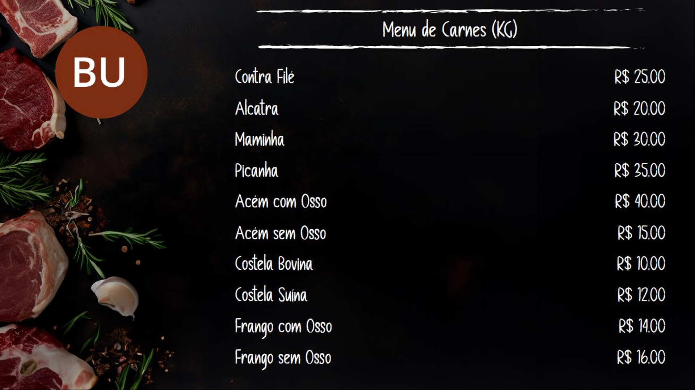

# DSPLAY - Menu Board (Standard) Template

A [React](https://reactjs.org/) [HTML-based template](https://developers.dsplay.tv/docs/html-templates) for the [DSPLAY - Digital Signage](https://dsplay.tv/) platform — a chalkboard-styled menu board listing up to 10 products with a name and price each.

> Built with [Vite](https://vitejs.dev/), requires Node.js 22.22.2+, 24.15.0+, or 26+ (see `.nvmrc`).

## Supported screen formats

| Landscape |
|-----------|
|  |

> This template's fixed side-by-side layout (logo column + menu column) only renders correctly in landscape. Portrait, square, and banner (horizontal/vertical) formats currently produce a broken layout — content is pushed off-screen or overlaps illegibly — so screenshots for those formats are omitted here until the layout is made responsive.

## Template variables

| Key                 | Type   | Description                                                                 |
|----------------------|--------|-------------------------------------------------------------------------------|
| `logo`               | string | Logo image shown next to the menu.                                          |
| `background_image`   | string | Background image. Falls back to a bundled default when unset.               |
| `menu_title`         | string | Title shown on the chalkboard banner above the product list.                |
| `prod_name01`..`10`  | string | Name of product 1 through 10. Unset slots fall back to "Product `<n>`".      |
| `prod_price01`..`10` | string | Price of product 1 through 10. Unset slots fall back to "Price `<n>`".      |

> Remember to also register these as Template Vars (same name and type) when configuring this template in the DSPLAY CMS.

## Local development

```sh
npm install
npm start
```

`public/dsplay-data.js` defines `dsplay_config`/`dsplay_media`/`dsplay_template` mock globals used only when the template isn't running inside the actual DSPLAY app. Edit it to try out different products/prices — the DSPLAY Player App replaces it with real content at runtime.

## Packing (release build)

```sh
npm run zip
```

This builds the template with Vite, which also generates `template-variables.json` + `template-example-data.json` (via [@dsplay/template-manifest](https://www.npmjs.com/package/@dsplay/template-manifest)'s Vite plugin) — the DSPLAY CMS reads these two files to auto-detect this template's variables and seed default preview values. It then generates `template.zip`, ready to be deployed to the [DSPLAY Web Manager](https://manager.dsplay.tv/template/create).

## Test assets

To use test assets (images, videos, etc) during development, put them in the `public/test-assets` folder and reference them in `dsplay-data.js` using their relative path. `public/test-assets` is automatically excluded from the release build.

## Maintaining dependencies

Regular npm dependencies, not vendored files:

```sh
npm outdated
npm update
```

For a version outside the declared range (typically a major bump), apply it deliberately and verify `npm start`, `npm run build`, and `npm test` still work before committing.

### Commit conventions

See [AGENTS.md](AGENTS.md).

## More

To see more about DSPLAY HTML Templates, visit: https://developers.dsplay.tv/docs/html-templates
